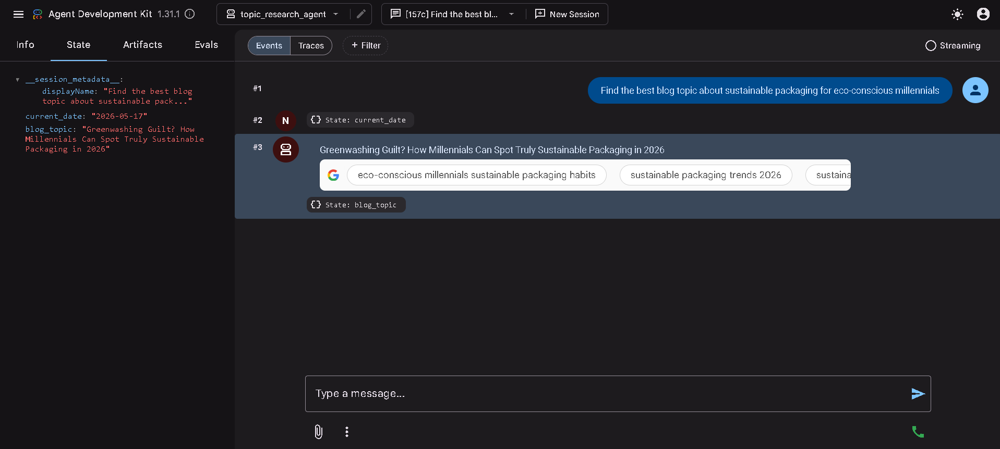
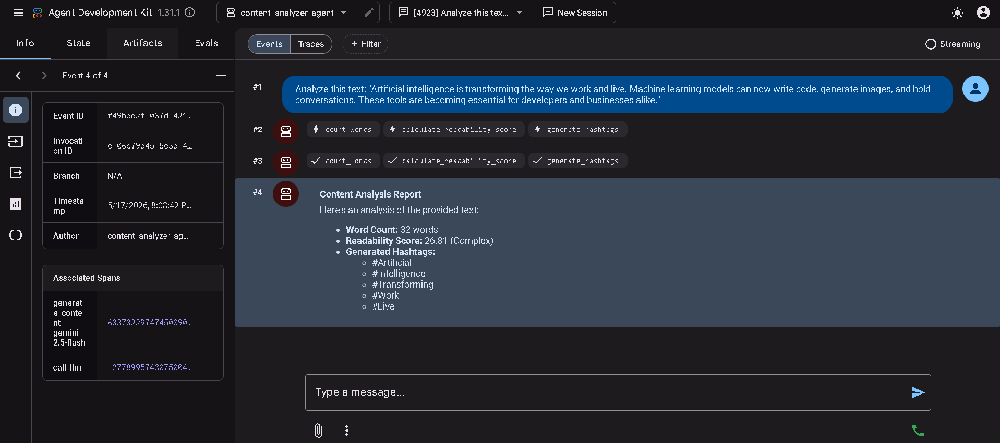
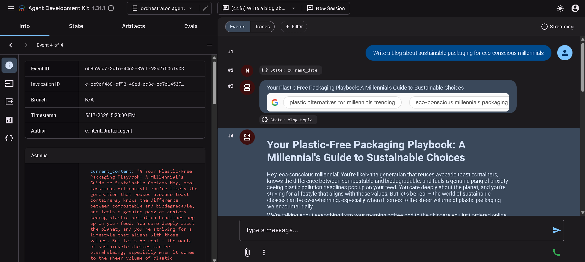

# AI DevCamp Session 4: GDG London - Content Creation Multi-Agent System

Welcome to the **AI DevCamp Session 4** repository! This project demonstrates how to build and orchestrate a sophisticated multi-agent system using the **Google Agent Development Kit (ADK)**. 

The system leverages multiple specialized AI agents working together to automate an end-to-end content creation pipeline—from researching and drafting to analyzing, improving, and generating final content formats (like blog posts, emails, and social media updates).

## Project Overview

The core of this project is a content orchestration workflow that uses different sub-agents:
- **Orchestrator Agent**: Manages the workflow and coordinates tasks among sub-agents.
- **Topic Research & Content Drafter Agents**: Gathers information and writes initial drafts.
- **Content Analyzer, Improver & Quality Checker Agents**: Reviews the content for word count, quality, and makes improvements.
- **Format Generators**: Includes agents for creating blog posts, SEO metadata, social media posts, and email newsletters.

## Testing Use Cases with ADK Web

The Google ADK provides a web interface to test and interact with our agents. Below are captures demonstrating the different use cases tested during the session:

### 04. Launching the ADK Web Interface with My First Agent
Testing the connection to the ADK Web Interface and loading the available agents.


### 05. Agent with custom tools
Testing content_analyzer_agent with custom tools.


### 06. Sequential Workflow: Research and Draft
Showcasing the research_and_draft_workflow: content_drafter_agent after topic_research_agent.


## Getting Started

To run the project locally, ensure you have `uv` installed for dependency management. We use `uv` for all our environment and package management.

```bash
# Navigate to the starter project
cd workshop/codelab/starter

# Sync the dependencies and setup the virtual environment
uv sync

# Run the ADK Web Interface
uv run adk web agents --allow_origins='*' --extra_plugins google.adk.plugins.logging_plugin.LoggingPlugin
```
