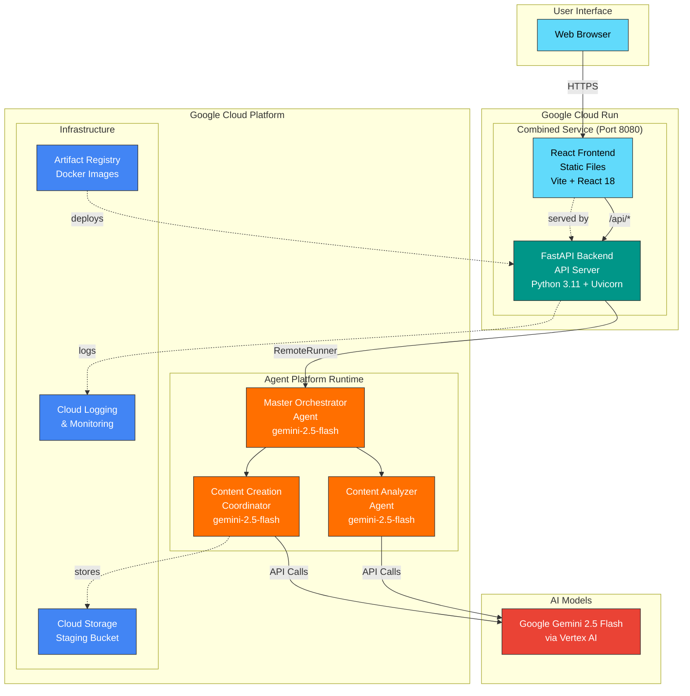
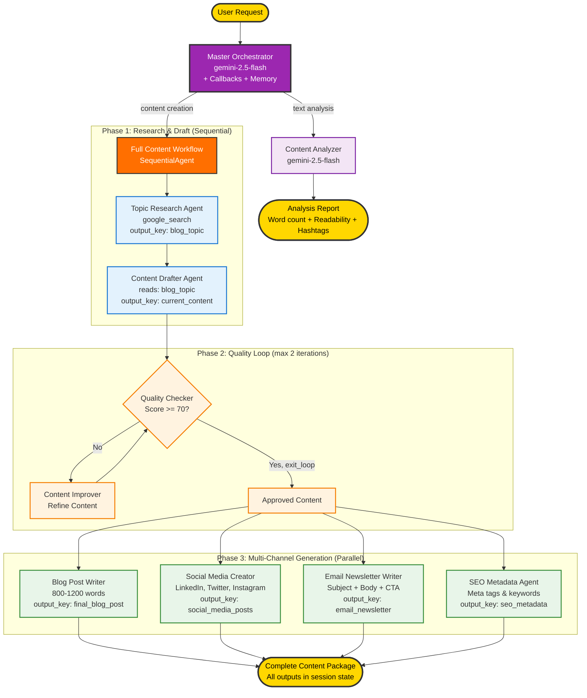

# Google ADK Multi-Agent on Gemini Enterprise Agent Platform

**Multi-Agent Content Creation design consideration Workshop**

An intelligent, multi-agent content creation system and comprehensive workshop powered by Google's Gemini models. This project demonstrates how to build AI agents with custom tools using Google's Agent Development Kit (ADK). Throughout the workshop, you will explore various design patterns (Sequential, Parallel, Iterative architectures), navigate agent architecture trade-offs (Sub-agents vs. Agent as a Tool), and master memory & context for reliable agent teams. It also covers implementing callbacks & observability, managing sessions, state, and artifacts, and achieving scalable deployment of a full-stack system (React frontend, FastAPI backend) to **Gemini Enterprise Agent Platform Runtime** (formerly Vertex AI Agent Engine) and Cloud Run on Google Cloud Platform.

## Workshop Notebooks - Start Here!

**New to AI agents?** Start with our interactive notebooks - no setup required, just click and learn!

Interactive Jupyter notebooks to learn how to build multi-agent systems step by step. Click the badge to open directly in Google Colab:

| Part | Topic | Description | Colab Link |
|------|-------|-------------|------------|
| 1 | First Agent | Create your first AI agent with Google ADK | [](https://colab.research.google.com/github/Saoussen-CH/google-adk-multi-agent-design-consideration-workshop/blob/main/notebooks/part1_first_agent.ipynb) |
| 2 | Custom Tools | Build custom tools for your agents | [](https://colab.research.google.com/github/Saoussen-CH/google-adk-multi-agent-design-consideration-workshop/blob/main/notebooks/part2_custom_tools.ipynb) |
| 3 | Agent Teams | Coordinate multiple agents working together | [](https://colab.research.google.com/github/Saoussen-CH/google-adk-multi-agent-design-consideration-workshop/blob/main/notebooks/part3_agent_teams.ipynb) |
| 4 | Architecture Patterns | LLM-Driven vs Workflow-Driven architectures and design trade-offs | [](https://colab.research.google.com/github/Saoussen-CH/google-adk-multi-agent-design-consideration-workshop/blob/main/notebooks/part4_architecture_patterns.ipynb) |
| 5 | Sequential Workflows | Sequential pipelines and agent coordination | [](https://colab.research.google.com/github/Saoussen-CH/google-adk-multi-agent-design-consideration-workshop/blob/main/notebooks/part5_sequential_workflows.ipynb) |
| 6 | Iterative Workflows | Create quality improvement loops | [](https://colab.research.google.com/github/Saoussen-CH/google-adk-multi-agent-design-consideration-workshop/blob/main/notebooks/part6_iterative_workflows.ipynb) |
| 7 | Parallel Workflows | Execute agents in parallel for efficiency | [](https://colab.research.google.com/github/Saoussen-CH/google-adk-multi-agent-design-consideration-workshop/blob/main/notebooks/part7_parallel_workflows.ipynb) |
| 8 | Callbacks, Context & Memory | Callbacks, sessions/state, artifacts, and memory, including ADK's LoggingPlugin for local observability | [](https://colab.research.google.com/github/Saoussen-CH/google-adk-multi-agent-design-consideration-workshop/blob/main/notebooks/part8_callbacks_context_memory.ipynb) |
| 9 | Capstone Project | Build the complete Content Creation Studio | [](https://colab.research.google.com/github/Saoussen-CH/google-adk-multi-agent-design-consideration-workshop/blob/main/notebooks/part9_capstone_project.ipynb) |
| 10 | Deployment | Deploy agents to Agent Platform Runtime on GCP | [](https://colab.research.google.com/github/Saoussen-CH/google-adk-multi-agent-design-consideration-workshop/blob/main/notebooks/part10_deployment_agent_engine.ipynb) |
| 11 | Full-Stack Cloud Run | Deploy full-stack app (React + FastAPI) to Cloud Run | [](https://colab.research.google.com/github/Saoussen-CH/google-adk-multi-agent-design-consideration-workshop/blob/main/notebooks/part11_fullstack_cloud_run.ipynb) |

### Workshop Learning Path

1. **Part 1-2**: Foundations - Learn basic agent creation and custom tools
2. **Part 3-4**: Agent Teams & Architecture Patterns - Coordinate agents and explore design trade-offs
3. **Part 5-7**: Workflows - Master sequential, iterative, and parallel agent workflows
4. **Part 8**: Callbacks, Context & Memory - Callbacks, sessions/state, artifacts, and long-term memory
5. **Part 9**: Capstone Project - Build the complete Content Creation Studio
6. **Part 10**: Deployment - Deploy to Agent Platform Runtime on GCP
7. **Part 11**: Full-Stack Cloud Run - Deploy the full-stack app (React + FastAPI + Agent Platform Runtime) to Cloud Run

**Tip**: Each notebook is self-contained and can be run independently in Google Colab. No local setup required!

---

## Workshop: Google ADK & Gemini Enterprise Agent Platform: Multi-Agent System Design

What we will cover:

- **Build AI Agents**: Create agents with custom tools.                                                                                           
- **Design Patterns**: Choosing between LLM-Driven and Workflow-Driven architectures (Sequential, Parallel, Iterative).                           
- **Agent Architecture**: Navigating the trade-offs between Sub-agents and Agent as a Tool.                                                           
- **Callbacks & Observability**: Implementing custom logging, guardrails, and metrics with callbacks, and utilizing ADK's built-in LoggingPlugin for comprehensive local debugging.                                                                                                                  
- **Management**: How to handle sessions, state, and artifacts within an integrated AI orchestration layer.                                       
- **Memory & Context**: Mastering Short-Term vs. Long-Term memory for reliable agent teams.                                                       
- **Scalable Deployment**: Deploying your full-stack Multi-Agent System to GCP environments.    

---

## Quick Start & Deployment

**New to this project?** Check out [**GETTING_STARTED.md**](GETTING_STARTED.md) for complete step-by-step instructions with 4 test prompts!


---

## Prerequisites

### Required Software
1. **Python 3.11.13** - For backend (via [pyenv](#python-version-management) recommended)
2. **Node.js 18+** - For frontend ([Download](https://nodejs.org/))
3. **Google API Key** - Get from [Google AI Studio](https://aistudio.google.com/app/apikey)
4. **pyenv** (optional) - Python version manager

### For Cloud Deployment
5. **Google Cloud Project** with billing enabled
6. **gcloud CLI** - [Install guide](https://cloud.google.com/sdk/docs/install)


### Python Version Management

This project requires Python 3.11.13. We recommend [pyenv](https://github.com/pyenv/pyenv) for version management.

```bash
# Install pyenv
curl https://pyenv.run | bash

# Add to your shell profile (~/.bashrc or ~/.zshrc)
export PATH="$HOME/.pyenv/bin:$PATH"
eval "$(pyenv init -)"

# Install and activate Python 3.11.13
pyenv install 3.11.13
pyenv local 3.11.13
python --version  # Should show: Python 3.11.13
```

The project includes a `.python-version` file that automatically activates the correct version.

---

## Features

### Two Main Capabilities:

1. **Create Content** - Full multi-agent content package generation
   - Blog posts (800-1200 words)
   - Social media content (LinkedIn, Twitter, Instagram)
   - Email newsletters
   - SEO metadata

2. **Analyze Text** - Text analysis using AI
   - Word count
   - Readability score
   - Hashtag generation

## Architecture

> **Mermaid Diagrams**:
> - [Architecture Diagram](diagrams/architecture.mmd) - Complete system architecture
> - [Multi-Agent System Diagram](diagrams/multi-agent-system.mmd) - Agent workflow and interactions

### System Overview



### Multi-Agent System



### Agent Responsibilities

| Agent | Type | Responsibility |
|-------|------|----------------|
| **Master Orchestrator** | LLM Agent | Routes requests to content workflow or analyzer |
| **Full Content Workflow** | SequentialAgent | Orchestrates the 3-phase content pipeline |
| **Research & Draft** | SequentialAgent | Runs topic research then content drafting in order |
| **Quality Improvement Loop** | LoopAgent | Checks quality and improves until score >= 70 (max 2 iterations) |
| **Parallel Content Creation** | ParallelAgent | Runs blog, social, email, and SEO agents concurrently |
| **Topic Research Agent** | LLM Agent | Identifies trending topics via google_search |
| **Content Drafter Agent** | LLM Agent | Creates initial content drafts |
| **Quality Checker Agent** | LLM Agent | Evaluates content quality (score 0-100) |
| **Content Improver Agent** | LLM Agent | Refines content based on feedback |
| **Blog Post Writer** | LLM Agent | Generates SEO-optimized blog posts (800-1200 words) |
| **Social Media Creator** | LLM Agent | Creates platform-specific social content |
| **Email Newsletter Writer** | LLM Agent | Writes engaging email newsletters |
| **SEO Metadata Agent** | LLM Agent | Generates meta descriptions and keywords |
| **Content Analyzer Agent** | LLM Agent | Analyzes text (readability, word count, hashtags) |


## Local Development Guide

### Prerequisites for Local Development

Before running locally, ensure you have:
1. Python 3.11.13 installed (via pyenv recommended)
2. Node.js 18+ installed
3. Google API Key from [Google AI Studio](https://aistudio.google.com/app/apikey)
4. Agent deployed to Agent Platform Runtime (see [Deploy Agent](#deploy-agent-to-agent-engine))

### Option 1: Local Agent (No Agent Platform Runtime Required)

Run the agent entirely on your local machine without deploying to Agent Platform Runtime.

**Step 1: Install Dependencies**
```bash
# Ensure Python 3.11.13 is active
python --version  # Should show 3.11.13

# Install Python dependencies
pip install -r requirements.txt

# Install frontend dependencies (optional)
cd frontend
npm install
cd ..
```

**Step 2: Configure Environment**
```bash
# Create .env file
cat > .env << 'EOF'
# Google API Configuration
GOOGLE_API_KEY=your_google_api_key_here
GOOGLE_GENAI_USE_VERTEXAI=0

# Agent Configuration
WORKER_MODEL=gemini-2.0-flash-exp
COORDINATOR_MODEL=gemini-2.0-flash-exp
QUALITY_SCORE_THRESHOLD=70
MAX_IMPROVEMENT_ITERATIONS=3
EOF
```

---

### Option 2: Local Backend + Agent Platform Runtime

Connect your local backend to a deployed Agent Platform Runtime instance.

**Step 1: Deploy Agent to Agent Platform Runtime**
```bash
# Deploy agent (one time)
python deployment/deploy.py --action deploy

# Copy the AGENT_ENGINE_RESOURCE_NAME from output
```

**Step 2: Configure Environment**
```bash
# Create .env file with Agent Platform Runtime resource
cat > .env << 'EOF'
# Google Cloud Configuration
GOOGLE_CLOUD_PROJECT=your-project-id
GOOGLE_CLOUD_LOCATION=us-central1
GOOGLE_API_KEY=your_google_api_key_here
GOOGLE_GENAI_USE_VERTEXAI=1

# Agent Platform Runtime resource (env var name kept for compatibility)
AGENT_ENGINE_RESOURCE_NAME=projects/.../locations/.../reasoningEngines/...

# Agent Configuration
WORKER_MODEL=gemini-2.0-flash-exp
COORDINATOR_MODEL=gemini-2.0-flash-exp
EOF
```

**Step 3: Run Backend Server**
```bash
# Start FastAPI backend
cd backend
python api_server.py
```

**Step 4: Run Frontend (Optional)**

Open a new terminal:
```bash
cd frontend
npm run dev
```

**Step 5: Access Application**
- Frontend UI: http://localhost:5173
- Backend API: http://localhost:8000
- API Docs: http://localhost:8000/docs

---

### Option 3: Full Local Stack (Backend + Frontend + Local Agent)

**Step 1: Install All Dependencies**
```bash
# Python dependencies
pip install -r requirements.txt

# Frontend dependencies
cd frontend && npm install && cd ..
```

**Step 2: Configure for Local Development**
```bash
# .env file (no Agent Platform Runtime required)
cat > .env << 'EOF'
GOOGLE_API_KEY=your_google_api_key_here
GOOGLE_GENAI_USE_VERTEXAI=0
WORKER_MODEL=gemini-2.0-flash-exp
COORDINATOR_MODEL=gemini-2.0-flash-exp
EOF
```

**Step 3: Start Backend (Terminal 1)**
```bash
cd backend
python api_server.py
```

**Step 4: Start Frontend (Terminal 2)**
```bash
cd frontend
npm run dev
```

**Step 5: Open Browser**
Navigate to http://localhost:5173

---

### Local Development Tips

#### Hot Reload
- **Backend:** Uvicorn auto-reloads on Python file changes
- **Frontend:** Vite hot-reloads on React file changes

#### Common Local Issues

**Issue: "AGENT_ENGINE_RESOURCE_NAME not set"**
```bash
# Option 1: Deploy agent to Agent Platform Runtime
python deployment/deploy.py --action deploy

# Option 2: Run locally without Agent Platform Runtime
# Set GOOGLE_GENAI_USE_VERTEXAI=0 in .env
```

**Issue: "Module not found"**
```bash
# Reinstall dependencies
pip install -r requirements.txt --force-reinstall

# For frontend
cd frontend && npm install
```

**Issue: Port already in use**
```bash
lsof -ti:8000 | xargs kill -9  # Backend
lsof -ti:5173 | xargs kill -9  # Frontend
```

---

## Project Structure

```
content_creation_mas/
├── notebooks/                 # Workshop notebooks (Parts 1-11)
│   ├── part1_first_agent.ipynb
│   ├── part2_custom_tools.ipynb
│   ├── part3_agent_teams.ipynb
│   ├── part4_architecture_patterns.ipynb
│   ├── part5_sequential_workflows.ipynb
│   ├── part6_iterative_workflows.ipynb
│   ├── part7_parallel_workflows.ipynb
│   ├── part8_callbacks_context_memory.ipynb
│   ├── part9_capstone_project.ipynb
│   ├── part10_deployment_agent_engine.ipynb
│   └── part11_fullstack_cloud_run.ipynb
├── backend/                   # FastAPI backend (Cloud Run)
│   ├── api_server.py         # API server that connects to Agent Platform Runtime
│   └── requirements.txt
├── frontend/                  # React UI (Cloud Run)
│   ├── src/
│   │   ├── components/
│   │   │   ├── ContentForm.jsx
│   │   │   ├── ContentDisplay.jsx
│   │   │   ├── ProgressIndicator.jsx
│   │   │   └── TextAnalyzer.jsx
│   │   ├── styles/
│   │   ├── App.jsx
│   │   └── main.jsx
│   └── package.json
├── content_creation_studio/   # Multi-agent system (Agent Platform Runtime)
│   ├── agent.py              # Root agent orchestrator
│   ├── tools.py              # Agent tools
│   └── sub_agents/           # Specialized agents
│       ├── topic_research_agent/
│       ├── content_drafter_agent/
│       ├── quality_checker_agent/
│       ├── content_improver_agent/
│       ├── blog_post_writer_agent/
│       ├── social_media_creator_agent/
│       ├── email_newsletter_writer_agent/
│       ├── seo_metadata_agent/
│       └── content_analyzer_agent/
├── deployment/                # Deployment scripts
│   ├── deploy.py             # Deploy agent to Agent Platform Runtime
│   ├── deploy-combined.sh    # Deploy frontend/backend to Cloud Run
│   └── cleanup.py            # Cleanup deployed resources
├── api_server.py             # Legacy local server
└── .env                      # Environment configuration
```

## Environment Variables

| Variable | Required | Default | Description |
|----------|----------|---------|-------------|
| `GOOGLE_API_KEY` | Yes | - | Your Google AI API key |
| `GOOGLE_CLOUD_PROJECT` | Yes | - | Google Cloud Project ID |
| `GOOGLE_CLOUD_LOCATION` | No | `us-central1` | GCP region for deployment |
| `GOOGLE_GENAI_USE_VERTEXAI` | No | `1` | Use Vertex AI (1) or AI Studio (0) |
| `AGENT_ENGINE_RESOURCE_NAME` | Yes* | - | Agent Platform Runtime resource name (*required for backend; var name kept for compatibility) |
| `WORKER_MODEL` | No | `gemini-2.5-flash` | Model for worker agents |
| `COORDINATOR_MODEL` | No | `gemini-2.5-flash` | Model for coordinator |
| `QUALITY_SCORE_THRESHOLD` | No | `70` | Min quality score |
| `MAX_IMPROVEMENT_ITERATIONS` | No | `3` | Max improvement loops |


## Documentation & Resources

### Architecture & Diagrams
- **[Architecture Diagram](diagrams/architecture.mmd)** - Complete system architecture (Mermaid format)
- **[Multi-Agent System Diagram](diagrams/multi-agent-system.mmd)** - Agent workflow and interactions (Mermaid format)
- **[Diagrams Guide](diagrams/README_DIAGRAMS.md)** - Complete guide to all diagrams

### Deployment Guides
- **[Deployment Overview](deployment/README.md)** - General deployment instructions
- **[Setup Guide](deployment/SETUP_GUIDE.md)** - Detailed GCP setup instructions

### Application Documentation
- **[Frontend README](frontend/README.md)** - React app documentation
- **[API Docs](http://localhost:8000/docs)** - Interactive API reference (when server running)

### External Resources
- **[Agent Development Kit (ADK) Documentation](https://docs.cloud.google.com/gemini-enterprise-agent-platform/build/adk)** - Official ADK docs
- **[Agent Platform Runtime Docs](https://docs.cloud.google.com/gemini-enterprise-agent-platform/build/runtime)** - Managed runtime for ADK agents
- **[Gemini Enterprise Agent Platform](https://docs.cloud.google.com/gemini-enterprise-agent-platform)** - Platform overview
## Contributing

This is a workshop project. Feel free to:
- Fork and experiment with the code
- Submit issues for bugs or improvements
- Share your enhanced versions

## License

This workshop is provided as-is for educational purposes.
